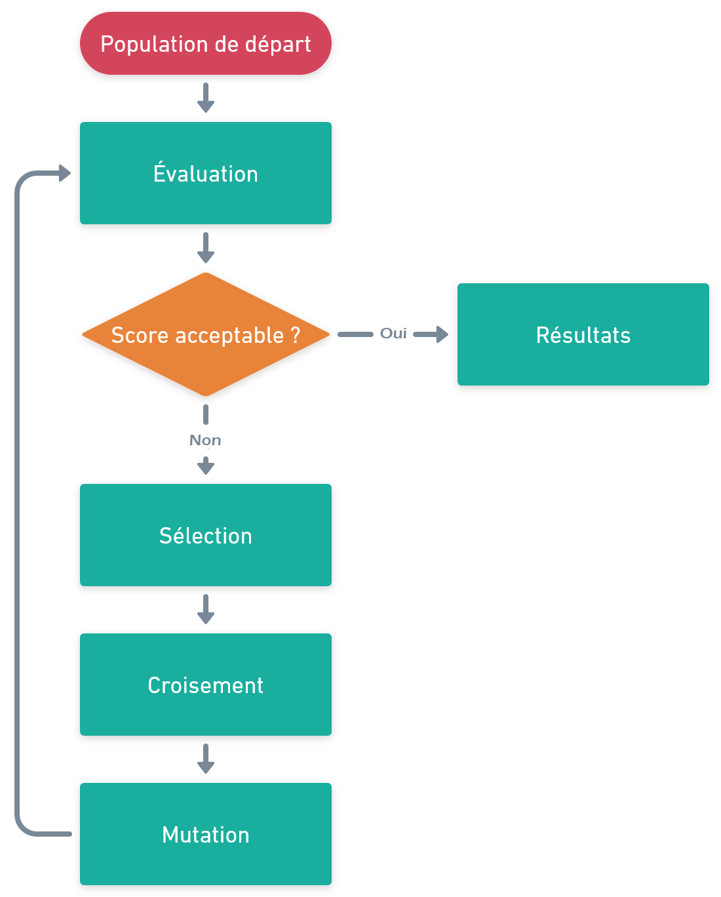
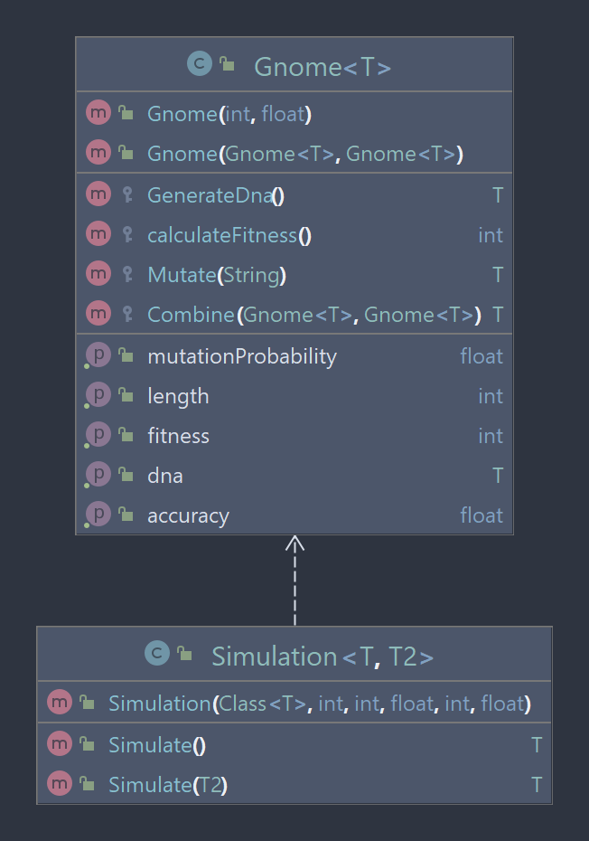

## Introduction

Un algorithme génétique permet de résoudre un problème grâce au principe de sélection naturelle. Par exemple, pour ce projet, j'ai choisi un problème simple qui consiste à trouver une chaîne de caractères avec seulement des voyelles. Là où réside la force de ce type d'algorithme est qu'à aucun moment je lui demande de retourner seulement des voyelles mais je note uniquement ce qu'il me retourne. Grâce à cette notation, l’algorithme "apprend" et donne des résultats de plus en plus proches du résultat attendu au fur et à mesure des générations.

Ce type d'algorithmes permet de résoudre des problèmes complexes avec une exécution rapide. On peut créer par exemple un algorithme qui joue à Mario, simuler des êtres vivants ou bien trouver le chemin le plus court. Ce n'est pas toujours l'algorithme le plus rapide ou avec le résultat le plus fidèle mais il est généralement plus simple à implémenter que la plupart des algorithmes de résolution.

Dans cet article, nous verrons le fonctionnement général d'un algorithme génétique et l'implémentation Java réalisée afin de pouvoir résoudre de manière générique des problèmes donnés.

## Principe de fonctionnement

Un algorithme génétique calque le principe de sélection naturelle. L'algorithme va créer une population de x individus avec des paramètres aléatoires (par exemple une taille, un poids, une liste de directions, ...). Ces paramètres sont l'ADN de l'individu. Cette population est la première génération. Ensuite, on calcule pour chaque individu son score (distance parcourus, durée de vie, ...). Une fois cette étape effectuée, on trie le score de chaque individu dans l'ordre croissant puis on prend les x meilleurs individus.

Maintenant, il faut faire évoluer nos individus. Dans la part des meilleurs individus sélectionnés, on crée des pairs auxquels on va fusionner leurs ADN. En général on prend 50% de l'un et 50% de l'autre, mais cela peut dépendre du problème et de ses paramètres. Enfin, on rajoute une part d'aléatoire en changeant un ou plusieurs paramètres avec une valeur aléatoire.

Une fois cette étape effectuée, on complète notre nouvelle population par des nouveaux individus afin d'atteindre le même nombre d'individus qu'au départ. Puis on recommence avec cette nouvelle génération. On crée autant de générations que l'on souhaite jusqu'à obtenir un résultat satisfaisant.



## Implémentation en Java

L'objectif de cette implémentation est de créer une classe générique pouvant être adaptée à tout type de problème. Je suis donc parti sur ce modèle :

- Classe `Gnome` : représente un individu. Cette classe permet de générer un individu, de calculer son score (appelé fitness), le combiner avec un autre gnome ou bien le faire muter.
- Classe `Simulation` : permet de simuler x générations et de combiner les individus.



Comme on peut le voir sur le diagramme UML, les classes utilises des génériques afin de pouvoir accepter différents types d'ADN ou bien de contextes comme dans la fonction `Simulate(T2)` (copie du monde de la simulation, obstacles, ...).

## Test avec un problème simple

Pour tester l'algorithme, nous allons réutiliser l'exemple donné dans l'introduction. Pour rappel, l'objectif est de trouver une chaîne de caractères avec le plus de voyelles possible. Nous allons donc implémenter la classe `Gnome` en créant une classe `SimpleGnome`.

On commence par redéfinir la fonction `GenerateDna()` pour qu'elle génère une chaîne de caractères aléatoires.

```java
@Override
protected String GenerateDna() {
	StringBuilder res = new StringBuilder();
	for (int x = 0; x < getLength(); x++)
		res.append(Utils.RandomLetter());
	return res.toString();
}
```

Ensuite, nous allons redéfinir la fonction `calculateFitness()` qui permet de calculer le score de l'individu. Pour cela, on ajoute 1 de score pour chaque voyelle.

```java
@Override
public int calculateFitness() {
	List<Character> v = List.of(new Character[]{'a', 'e', 'i', 'o', 'u', 'y'});
	int score = 0;

	for (int x = 0; x < getDna().length(); x++)
		if (v.contains(getDna().charAt(x))) score++;

	return score;
}
```

Donc par exemple le gnome `gtpm` aura un score de 0 (0 voyelle, 4 consonnes) et le code `aekl` aura un score de 2 (2 voyelles, 2 consonnes).

Pour le croisement de deux gnomes, on redéfinit la fonction `Combine()`. Cette fonction prend en paramètre 2 classes gnomes et retourne l'ADN issu de la combinaison des deux.

```java
@Override
protected String Combine(Gnome<String> a, Gnome<String> b) {
	return a.getDna().substring(0, a.getLength() / 2) + b.getDna().substring(a.getLength() / 2);
}
```

Pour cela, on prend les 50 premiers % du gnome A auxquel on ajoute les 50 derniers % du gnome B. L'ensemble des deux donne le gnome C.

Enfin, on redéfinit la fonction `Mutate()` afin d'ajouter une partie d'aléatoire pour chaque individu. Cette méthode a une probabilité de faire une mutation. Si c'est le cas, elle prend un caractère aléatoire et le remplace par une lettre aléatoire.

```java
@Override
protected String Mutate(String dna) {
	if (Utils.RandomBool(getMutationProbability())) {
		char[] c = dna.toCharArray();
		c[Utils.RandomMinMax(0, dna.length())] = Utils.RandomLetter();
		return String.valueOf(c);
	}
	return dna;
}
```

Voilà, notre gnome est prêt ! Maintenant on peut lancer la simulation avec le code suivant :

```java
const nbGenerations = 10;
const populationSize = 10000;
const parentRate = 0.01f;
const dnaLength = 10;
const mutationProbability = 0.1f

Simulation<SimpleGnome> simulation = new Simulation<>(SimpleGnome.class, nbGenerations, populationSize, parentRate, dnaLength, mutationProbability);

SimpleGnome res = simulation.Simulate();

System.out.println(res.getDna());
System.out.println(res.getFitness());
```

Ce code lance donc une simulation avec 10 générations de 10000 individus, avec une chaîne de caractères de longueur 10. Il prend 1% des parents pour les combiner et à 10% de chance de muter.

La fonction `Simulate()` retourne le meilleur individu de la dernière génération. On obtient le résulat suivant :

```bash
euoeuaouuh
9
```

La chaîne de caractères a 9 voyelles sur 10 caractères ce qui nous donne une précision de 90%. En jouant avec les paramètres on peut obtenir un résultat proche du 100%. Il faut prendre en compte que dû à l'utilisation d'aléatoire, si on relance l'algorithme on n'aura pas forcément le même résultat mais avec un score proche du précédent.

Et voilà comment on peut résoudre un problème basique avec un algorithme de génétique. Évidemment cet exemple est très simple mais ce type d'algorithmes permet de résoudre des problèmes bien plus complexes très rapidement.
