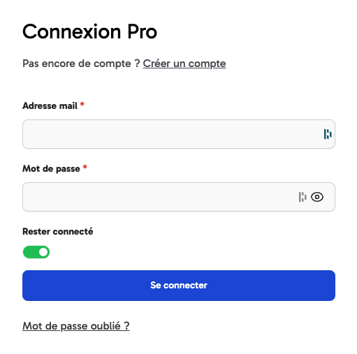

# Sommaire

1. [Présentation du projet](#1-présentation-du-projet)
2. [Technologies utilisées](#2-technologies-utilisées)
3. [Mon rôle dans le projet](#3-mon-rôle-dans-le-projet)
   - [Authentification](#authentification)
   - [Système de formulaires](#système-de-formulaires)
   - [Système de tableaux](#système-de-tableaux)
   - [Chatbot](#chatbot)
   - [Autres tâches](#autres-tâches)
4. [Conclusion](#4-conclusion)
5. [Photos du site](#5-photos-du-site)

---

## 1. Présentation du projet

Gradhire était notre projet d'étude sur l'entièreté du premier semestre de notre deuxième année de BUT Informatique.
Il s'agit d'un site web de mise en relation entre des entreprises et des étudiants.
Les entreprises peuvent poster des offres de stages ou d'alternance et les étudiants peuvent postuler à ces offres.
Le site permet également aux responsables de stages de suivre les étudiants tout au long du processus de postulation, de visites de stages et de soutenance.
Nous étions 4 étudiants sur ce projet : [Giovanni Gozzo](https://www.linkedin.com/in/giovanni-gozzo-99331a252/), [Daniil Hirchyts](https://www.linkedin.com/in/daniil-hirchyts-5a44481b1/), [Clément Garro](https://www.linkedin.com/in/clement-garro-2b58ba263/) et moi-même.

## 2. Technologies utilisées

Pour ce projet, nous avions le droit uniquement à du PHP pur. Interdiction d'utiliser des frameworks comme Symfony ou Laravel. Nous devions suivre une architecture MVC.
Nous devions également utiliser une base de données SQL. Nous avons choisi d'utiliser PostgreSQL.

Pour le reste, nous avons utilisé TailwindCSS pour le style du site. GitHub pour le versionning du code. Et enfin, Docker et AWS pour le déploiement du site.

## 3. Mon rôle dans le projet

Dans cette rubrique, je vais vous présenter quelques fonctionnalités que j'ai développées que j'estime être les plus intéressantes.

### Authentification

J'ai développé entièrement le système d'authentification du site. C'était une tâche assez complexe car premièrement, il y a 2 systèmes de connexion au site :
- Connexion via le LDAP de l'IUT pour les étudiants et le staff de l'IUT
- Connexion via email + mot de passe pour les entreprises et tuteurs en entreprise

Deuxièmement, la gestion des rôles était assez complexe. Il y a en tout 8 rôles différents :
- Étudiant
- Entreprise
- Tuteur en entreprise et tuteur universitaire
- Responsable de stage et responsable d'alternance
- Chef de département
- Professeur
- Secrétariat

J'ai également développé le système de mot de passe oublié. Pour les tuteurs en entreprise, la création de comptes est différente de celle des entreprises. En effet, les tuteurs en entreprise doivent être liés à une entreprise. Il faut donc que l'entreprise crée un compte sur le site en donnant l'adresse email du tuteur. Ce dernier recevra un email avec un lien pour créer son compte.

### Système de formulaires

J'ai développé un système de formulaires. Cela permet de créer des formulaires facilement et rapidement. Il permet de répondre à plusieurs problématiques :
- C'est pénible d'écrire du HTML
- C'est illisible et très difficile à maintenir (relire un formulaire HTML de 200 lignes bon courage)
- Il faut tout revérifier côté serveur (vérification des champs, des types, etc.)
- Garder un style cohérent sur tout le site

Bref, j'ai dû réinventer la roue. Mais bon, c'était sympa à faire. Voici un exemple d'utilisation pour un formulaire de connexion :

```php
public function pro_login(Request $request): string|null
{
    // 1. Création du formulaire
    $loginForm = new FormModel([
        "email" => FormModel::email("Adresse mail")->required()->asterisk(),
        "password" => FormModel::password("Mot de passe")->min(8)->asterisk(),
        "remember" => FormModel::switch("Rester connecté")->default(true)->forget()
    ]);
    
    // 2. Validation du formulaire si c'est une requête POST
    if ($request->getMethod() === 'post') {
        if ($loginForm->validate($request->getBody())) {
            $dt = $loginForm->getParsedBody();
            // logique de connexion
        }
    }
    
    // 3. Affichage du formulaire
    return $this->render('auth/pro_login', [
        'form' => $loginForm
    ]);
}
```

1. On crée le formulaire et on référence les inputs en précisant leurs contraintes. Il s’agit
   donc d'une array où chaque élément est créé via le Builder FormModel (password, int,
   double, checkbox, switch, date, select,...). Le système prend en charge 13 types d’inputs.
   Ensuite, on peut rajouter des règles comme required, default, min (longueur minimum) et
   beaucoup d’autres. Ces règles sont ajoutées au HTML (comme par exemple `require` en
   ajoutant l’attribut `required` de l’input dans l’HTML).
2. On vérifie d’abord que la méthode de la requête est de type post.
   Ensuite, on vérifie que les données sont valides avec la fonction `validate` du form. S'il y a
   des erreurs, elles seront affichées dans le formulaire sous l’input qui lui correspond.
3. On donne à la view le formulaire afin de l’afficher.

On affiche ensuite comme ceci le formulaire dans la view :

```php
<?php $form->start(); ?>
<div class="w-full gap-4 flex flex-col">
    <?php
    $form->print_all_fields();
    $form->getError();
    $form->submit("Se connecter");
    ?>
</div>
<?php $form->end(); ?>
```

Et voilà, en quelques lignes de code, on a un formulaire fonctionnel et stylé. Voici ce que l'exemple ci-dessus donne :



### Système de tableaux

Dans la même veine que le système de formulaires, j'ai développé un système de tableaux. Cela permet de créer des tableaux facilement et rapidement. Il permet notamment :
1. D'afficher des données de la base de données
2. De trier les colonnes
3. D'avoir une barre de recherche
4. D'avoir une pagination

Voici un exemple d'utilisation :

```php
Table::createTable($utilisateurs, ["nom", "email", "numéro de téléphone"], function ($utilisateur) {
    Table::cell($utilisateur->getNom());
    Table::email($utilisateur->getEmail());
    Table::phone($utilisateur->getNumtelephone());
});
```

On passe donc à la fonction `createTable` comme premier paramètre notre liste de données à afficher. Ensuite, on passe un tableau de string qui correspond au nom des colonnes que l'on veut afficher. Enfin, on passe une fonction qui sera appelée pour chaque ligne du tableau. Cette fonction prend en paramètre l'objet de la ligne à afficher. On peut ensuite utiliser des fonctions comme `cell`, `email` et `phone` pour afficher les données.
Et voilà, comme pour les formulaires, on a un tableau fonctionnel et stylé en quelques lignes de code.


### Chatbot

Afin de répondre aux questions des étudiants, j'ai créé un chatbot basé sur ChatGpt qui a été nourri avec un maximum d'informations sur les stages et alternances. Je ne l'ai pas codé en PHP, car j'ai utilisé la librairie OpenAI en JS. J'ai donc créé une API en TypeScript avec Express. Celle-ci a accès à la base de données PostgreSQL afin de récupérer les informations de l'utilisateur.


### Autres tâches

J'ai réalisé de nombreuses autres tâches sur ce projet comme :
- Système de notifications
- Système de calendrier
- Filtres de recherche pour les offres
- Abonnement à une newsletter pour les étudiants selon leurs filtres de recherche
- Modification du profile
- Envoie de mails
- Deploiement du site sur AWS et Dockerisation du projet
- Refactorisation de nombreux systèmes
- D'autres trucs que j'ai oublié

## 4. Conclusion

Avec ce projet, j'ai appris beaucoup notamment sur le travail en équipe. Les méthodes agiles ont permis un flow continu d'ajouts sur le site et une très bonne organisation. J'ai également appris beaucoup sur l'utilisation de Git en équipe.
L'utilisation de branches, de pull request, d'issues et l'utilisation de kanban sur Github nous ont permis un travail d'équipe très efficace.

Nous avions pour ce projet un client factice. Pour ce projet, nous avions 4 sprints (d'environ 1 mois chacun), auquel il fallait faire une présentation orale devant le client et d'autres profs. C'était pour moi un très bon exercice d'apprendre à présenter un projet possédant énormément de fonctionnalités dans un délai court à un client qui peut ne rien connaître en informatique.

C'était pour moi une très bonne expérience. En plus, l'entente était très bonne avec l'équipe. Je ne pense pas avoir trop appris en programmation mise à part sur le réfactoring.

## 5. Photos du site


