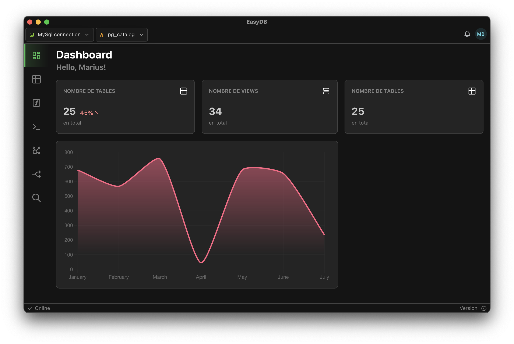
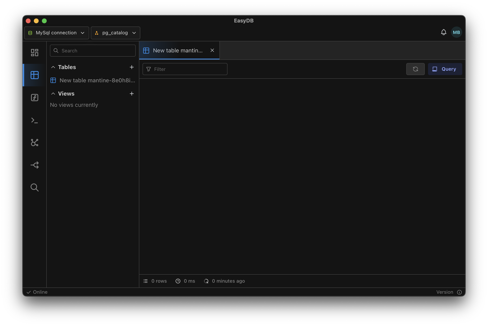
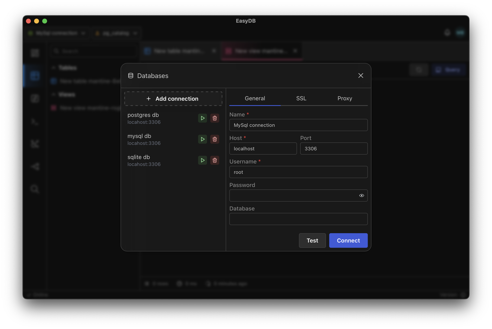
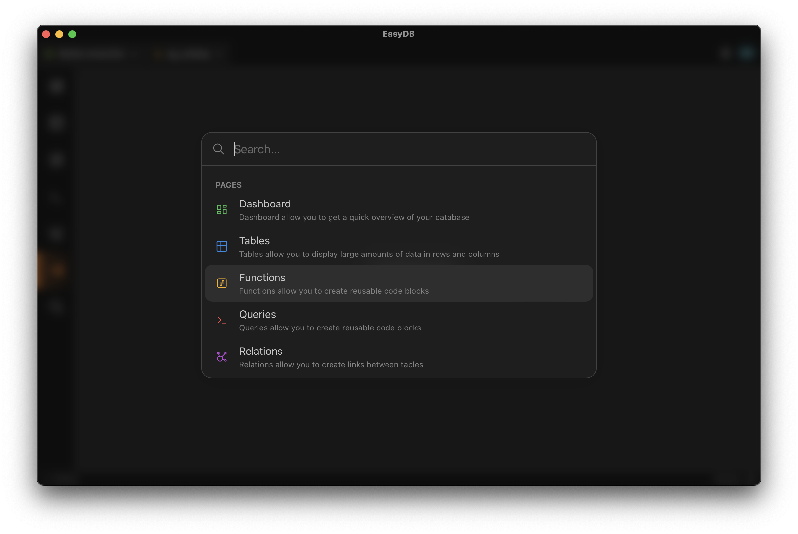

Large Relational Model (LRM) est un logiciel de modélisation de bases de données relationnelles.
Il permet de créer des modèles de données, de les modifier, de les visualiser et de les exporter.
Il est utilisé par des étudiants en informatique à l'IUT de Lens pour apprendre la modélisation de bases de données relationnelles grâce à des schémas E/A.

Le but de ce projet est de simplifier la modélisation de bases de données et leur maintenance.
J'ai fait un constat : les outils existants sont soit trop complexes, soit trop limités. Leurs licences sont souvent coûteuses.
C'est de ce constat qu'est né LRM.

Voici les objectifs du projet :
1. Modéliser une base de données sans écrire de SQL via un schéma E/A
2. Versionner la base de données grâce à des migrations
3. Pouvoir faire des collections de requêtes SQL
4. Manipuler les données de la base de données
5. Dashboard personnalisable

Le projet est actuellement un prototype.

# Choix de la stack

Pour la stack, j'ai décidé de partir sur des technologies innovantes.
C'est pour ça que je me suis tourné vers Tauri, une technologie qui permet de faire des applications desktop cross-platform en utilisant des frameworks web.
Le logiciel est donc écrit en Rust, ce qui permet d'avoir une application très performante et des requêtes SQL très rapides.
Pour le front-end, j'ai choisi React pour sa popularité et sa facilité d'utilisation. Enfin, j'ai choisi TailwindCSS et Mantine pour le style de l'application.

Cette stack permet de concevoir rapidement un prototype.

# Fonctionnalités

## Dashboard

L'objectif du dashboard est de pouvoir visualiser des données grâce à des widgets.
Ces widgets sont configurables grâce à des requêtes SQL. Cela permet à l'utilisateur de visualiser les données qu'il souhaite.

## Entités SQL

L'utilisateur doit pouvoir visualiser tous les types d'entités SQL (tables, vues, procédures stockées, etc.) et leurs propriétés.
Il n'est pas encore possible de visualiser les données des tables.

## Gestion des connexions

L'utilisateur peut ajouter toutes ses bases de données et les gérer. Pour l'instant le logiciel supporte PostgreSQL, MySql et SQLite.

## Système de recherche

Un système de recherche a été implémenté pour faciliter la navigation dans l'application.
Il permet notamment de rechercher une entité SQL ou bien une page de l'application.

## Modélisation

La modélisation par schéma E/A n'est pas encore implémentée. 

# Conclusion

Le logiciel est actuellement dans un état très préliminaire. Il reste beaucoup de fonctionnalités à implémenter.
Je n'ai actuellement très peu de temps à consacrer à ce projet à cause des études,
mais je compte bien le continuer, car c'est selon moi un projet très intéressant et qui a du potentiel.
