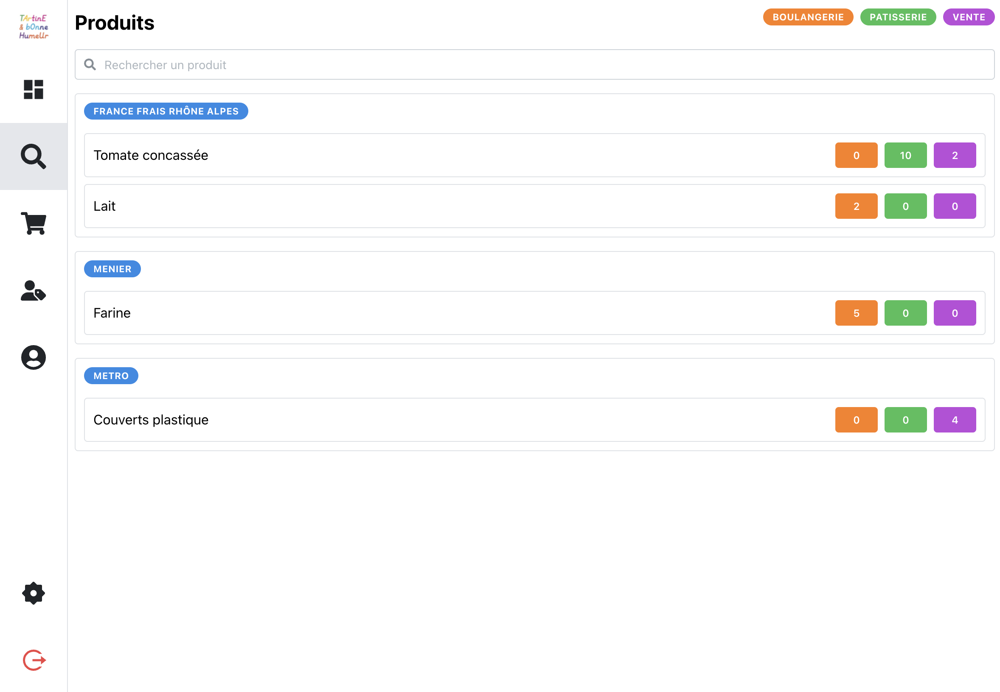
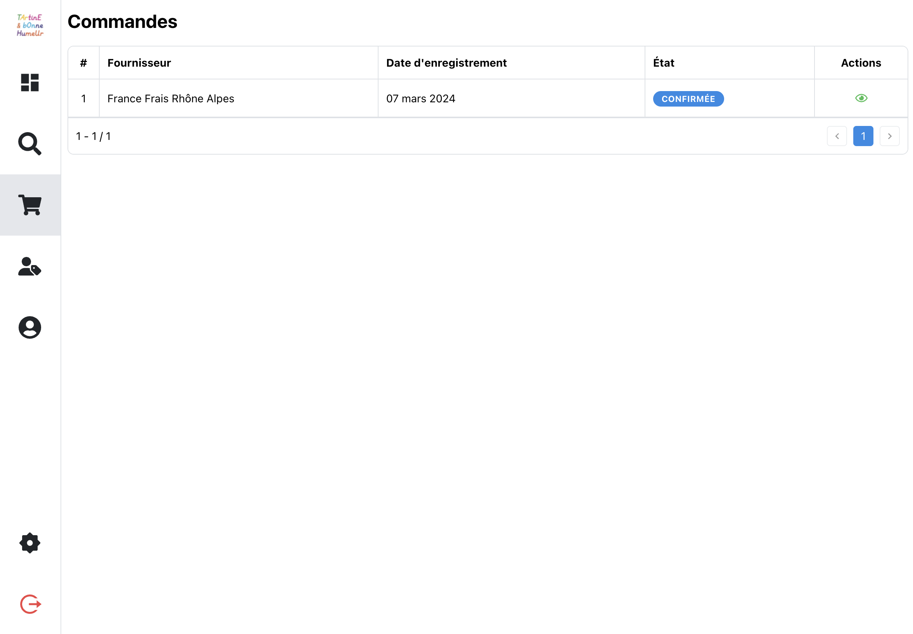
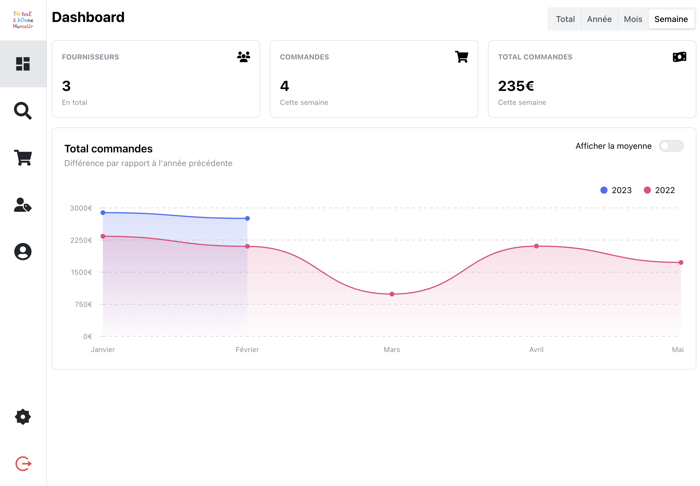

> Ce projet est en cours de développement et les images sont celles du prototype. Le design a été changé depuis. Je mettrais à jour cette article lors ce que le MVP aura été déployé.

Le but de ce logiciel SRM (Suppliers Relationship Management) est de permettre à une entreprise de gérer ses commandes fournisseurs. Il permet notamment de :
1. Ajouter des produits en commande
2. D'automatiquement envoyer des commandes aux fournisseurs à des heures et dates données
3. Aux fournisseurs de confirmer ou non la commande
4. De gérer les stocks
5. De gérer le planning des employés

L'objectif principal de ce projet est de permettre à l'entreprise de gagner du temps en permettant aux employés de rajouté à la liste des produits à commander ceux dont ils ont besoins.
Le logiciel est initialement développé pour une boulangerie qui a besoin de commander régulièrement de la matière première avec plusieurs livraisons par semaine.

# Fonctionnement

Les employées possédant un compte peuvent ajouter des produits à la liste de commande. Ces produits seront automatiquement commandés à la date défini pout chaque fournisseur (exemple : le fournisseur A tout les mardis et jeudi à 14h).
Pour ajouter un produit, il suffit de le chercher dans la liste, puis en cliquant sur le bouton correspondant à son secteur (boulangerie, patisserie ou vente). On peut ensuite choisir la quantité souhaité.

Ce système permet de savoir les besoins dans chaque secteur et de ne pas oublier de commander un produit.

# Commandes

Les commandes sont donc envoyées au mail du fournisseur avec un pdf contenant la liste des produits commandés. Le fournisseur peut ensuite confirmer ou non la commande via un bouton dans le mail.
En cas de problème, il contacte l'entreprise par téléphone qui peut modifier la commande ou l'annuler.
Un tableau affiche la liste des commandes passées avec leurs état (en attente, confirmée, refusé).
On peut également voir le détail de la commande en cliquant sur la ligne correspondante.

# Dashboard

Le dashboard permet de visualiser les commandes à venir, les commandes en cours, les commandes passées ou bien le montant total des commandes.

# Stack utilisée

Sur le prototype, j'ai utilisé les technologies suivantes :
- Front-end : ViteJs, React, TailwindCSS, Mantine
- Back-end : Pocketbase, Go

Pour le MVP, j'ai décidé de partir sur une stack plus classique et plus solide :
- Front-end : React, TailwindCSS, Shadcn
- Back-end : NextJs, Prisma, PostgreSQL, Next-Auth
- Serveur : Vercel